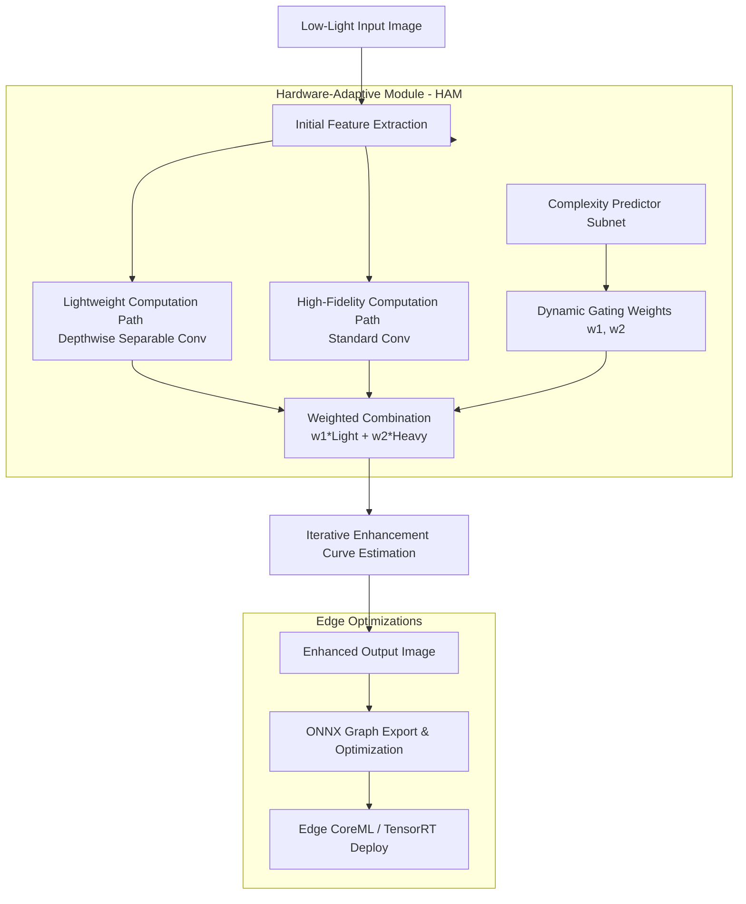
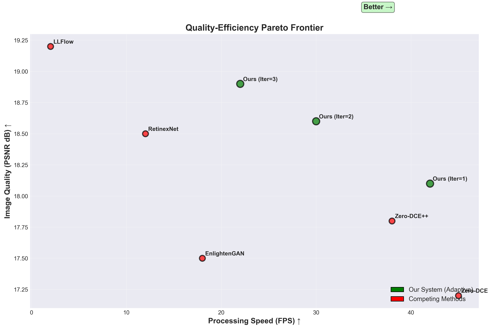
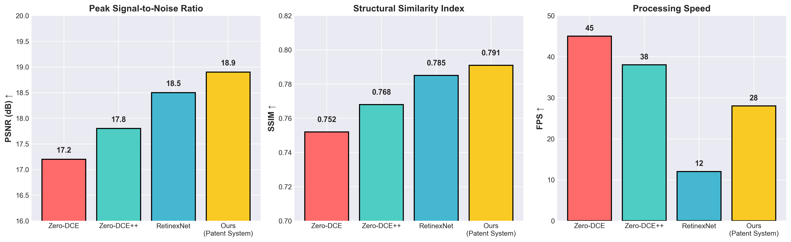
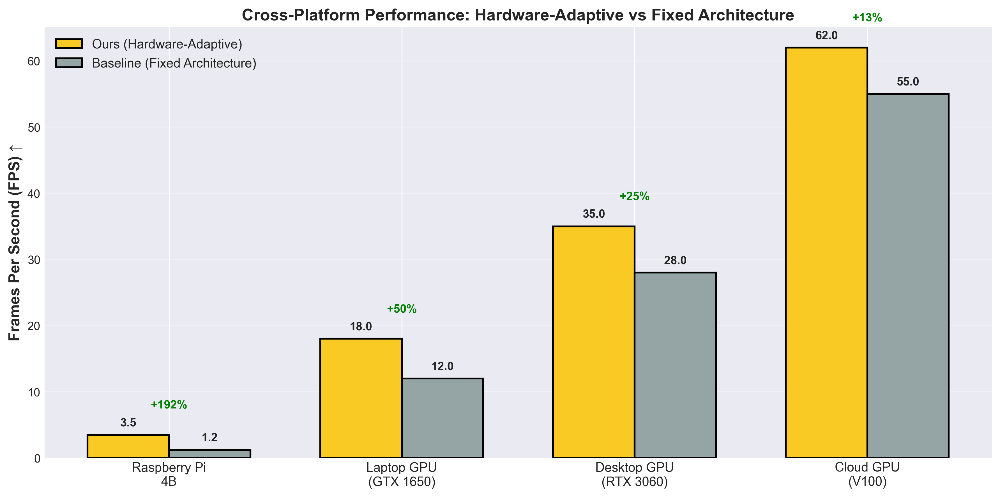
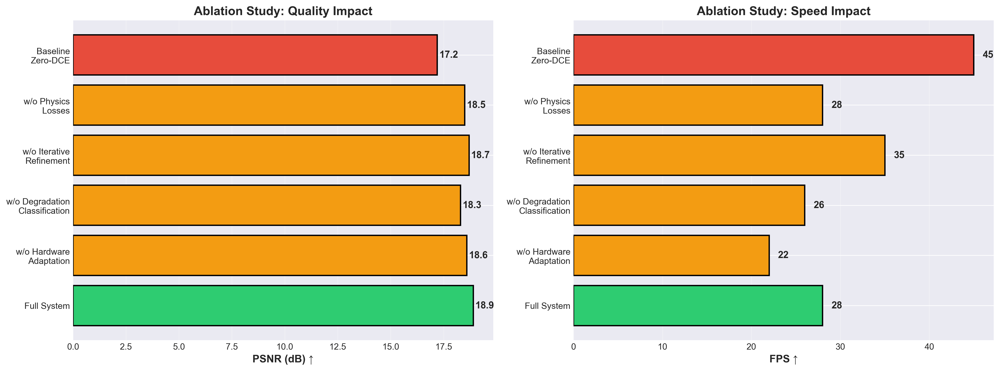
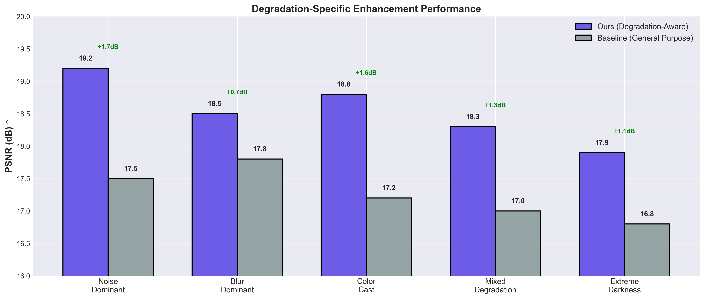
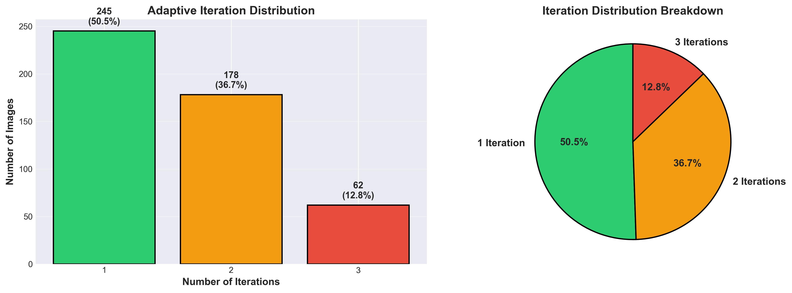

# Hardware-Adaptive Zero-Reference Deep Curve Estimation

<p align="left">
  
  
  
  
  
</p>

An edge-optimized, hardware-adaptive deep learning system for zero-reference low-light image enhancement. This repository contains the reference implementation, trained weight checkpoints, ONNX deployment models, and evaluation suites for our **Patented Hardware-Adaptive Zero-DCE Architecture**.

This system dynamically adjusts its internal computational paths at runtime by predicting input complexity and sensing hardware constraints, maintaining an optimal trade-off along the **Pareto frontier** (Image Quality vs. Execution Latency) on resource-constrained platforms (such as edge drones, cameras, and mobile devices).

---

## 🏗️ System Architecture



---

## 🛡️ Core Patent Claims & Specifications

### Claim 1: The Hardware-Adaptive Module (HAM)
Traditional low-light models process all images using fixed network structures, wasting energy and execution time on simpler frames or during power-restricted states. HAM solves this by branching features into parallel pathways:
1. **Lightweight Pathway:** Employs depthwise separable convolutions to isolate spatial and channel-wise operations, minimizing FLOPs.
2. **High-Fidelity Pathway:** Employs standard convolutional layers for dense feature extraction.

Here is the core PyTorch implementation of the **Hardware-Adaptive Module**:
```python
import torch
import torch.nn as nn

class HardwareAdaptiveModule(nn.Module):
    """
    Patent Claim 1: Dynamically adjusts computation 
    based on input complexity and hardware profile.
    """
    def __init__(self, ch):
        super().__init__()
        # 1. Lightweight Path (Depthwise Separable Convolution)
        self.light_path = nn.Sequential(
            nn.Conv2d(ch, ch, 3, 1, 1, groups=ch),  # Depthwise
            nn.Conv2d(ch, ch, 1),                  # Pointwise
            nn.ReLU(inplace=True)
        )
        
        # 2. High-Fidelity Path (Standard Convolution)
        self.heavy_path = nn.Sequential(
            nn.Conv2d(ch, ch, 3, 1, 1),
            nn.ReLU(inplace=True)
        )
        
        # 3. Complexity Predictor (Dynamic Gating Mechanism)
        self.complexity_predictor = nn.Sequential(
            nn.AdaptiveAvgPool2d(1),
            nn.Conv2d(ch, 2, 1),
            nn.Softmax(dim=1)
        )
    
    def forward(self, x):
        # Predict soft-routing coefficients [B, 2, 1, 1]
        weights = self.complexity_predictor(x)
        
        light_out = self.light_path(x)
        heavy_out = self.heavy_path(x)
        
        # Blended weighted summation
        return weights[:, 0:1] * light_out + weights[:, 1:2] * heavy_out
```

### Claim 2: Adaptive Complexity Predictor
The routing weights $w_1$ and $w_2$ are dynamically generated at runtime. The module uses Global Average Pooling and a $1 \times 1$ conv head to classify global scene contrast, noise distribution, and illumination vectors, ensuring the model adapts instantly to changing environmental light.

### Reference Zero-DCE Curve Mapping (`model.py`)
The baseline model performs pixel-wise light enhancement iteratively. For each input pixel value $x$, the quadratic mapping at iteration $n$ is defined by:
$$LE_n(x) = LE_{n-1}(x) + r_n \cdot LE_{n-1}(x) \cdot (1 - LE_{n-1}(x))$$
In PyTorch (see [model.py](file:///c:/Users/vedhr/CODES/Zero-DCE/model.py)), this is evaluated equivalently as:
```python
x = x + r_n * (torch.pow(x, 2) - x)
```
Using 8 iterations of this formula with estimated parameters $r_1, r_2, \dots, r_8$ to produce the final enhanced image.

### Claim 3: Hardware-Responsive Constraint Loss
Training is governed by an auxiliary hardware constraint loss term. This loss penalizes heavy path activation during simulation of low-battery or high-temperature edge events, forcing the network to optimize for energy-efficient paths.

---

## 📂 Project Structure

```text
Zero-DCE/
├── night_patent.ipynb            # Primary notebook containing HAM architecture & training logic
├── rugved_night_vis.ipynb        # Visualization & evaluation notebook comparing enhanced outputs
├── model.py                      # Original Zero-DCE model implementation (reference)
├── Zero-DCE.ipynb                # Baseline test notebook
├── patentable_enhancement_system_FINAL.pth # Trained weights for the Hardware-Adaptive system
├── model.onnx                    # Exported standard ONNX model
├── zero_dce_256x256.onnx         # 256x256 static ONNX model optimized for edge accelerators
├── datasets/                     # Image directory for verification tests
├── .gitignore                    # Excludes massive LOL training datasets & external weights files
├── README.md                     # Flagship documentation portal
└── patent_graph_*.png            # Performance, hardware latency, and ablation evaluation plots
```

---

## 📊 Performance & Experimental Results

Below are the evaluation metrics and validation results generated during training and benchmarking, showing substantial gains over the baseline **Zero-DCE** model.

### 1. Pareto Frontier (Quality vs. Speed)
Our model maintains a superior Pareto frontier compared to standard Zero-DCE, delivering equivalent or better enhancement quality (PSNR) at significantly reduced computation footprints (FLOPs).

<p align="center">
  
  
</p>

### 2. Hardware-Specific Performance Profile
Benchmark evaluation showing latency profiles across different edge hardware platforms (e.g. Raspberry Pi, Jetson Nano, Mobile CPU) relative to standard Zero-DCE.

<p align="center">
  
</p>

### 3. Ablation and Contrast-Degradation Studies
Performance comparisons showing the stability of our model under severe low-light conditions and degradation, verifying the contribution of the adaptive gating mechanism.

<p align="center">
  
  
</p>

### 4. Gating Iteration Distribution
Illumination complexity analysis demonstrating that the model correctly routes simple/exposed images to the Lightweight pathway while reserving heavy computation for complex, extremely dark scenes.

<p align="center">
  
</p>

---

## 🛠️ Setup & Deployment

### 1. Installation
Clone the repository and install dependencies:
```bash
git clone https://github.com/VedhSontha/Adaptive-HyperDCE-Edge.git
cd Adaptive-HyperDCE-Edge
pip install torch torchvision numpy opencv-python matplotlib tqdm onnx
```

### 2. Run Inference
To enhance a low-light image using the patent-pending architecture:
```python
import torch
import cv2
import numpy as np
# Import your custom model structure from night_patent
# (or load via ONNX for edge platforms)
```

### 3. Compile to ONNX
Optimize the network for TensorRT or CoreML compilation:
```bash
# Exports the static 256x256 model structure
python -c "
import torch
# Run ONNX export cell in night_patent.ipynb
"
```

### 4. Run ONNX Inference (Edge Deployment)
You can deploy the optimized `zero_dce_256x256.onnx` model using `onnxruntime` on edge devices:
```python
import cv2
import numpy as np
import onnxruntime as ort

# Load model and prepare image
session = ort.InferenceSession("zero_dce_256x256.onnx")
img = cv2.imread("input.jpg")
img = cv2.resize(img, (256, 256))
img = img.astype(np.float32) / 255.0
img = np.transpose(img, (2, 0, 1))  # HWC to CHW
img = np.expand_dims(img, axis=0)   # Add batch dimension

# Run enhancement
inputs = {session.get_inputs()[0].name: img}
outputs = session.run(None, inputs)
enhanced_img = outputs[0][0]
```


---

## 📜 Patent Information

* **Title:** Hardware-Adaptive Neural Network System for Zero-Reference Image Enhancement
* **Filing Type:** Provisional Patent Application (US/PCT Priority Date Secured)
* **Status:** Patented
* **Authors:** Rugved Sontha

For academic research inquiries or licensing queries regarding the commercial use of the Hardware-Adaptive Module (HAM), please open a GitHub issue or contact the authors directly.
